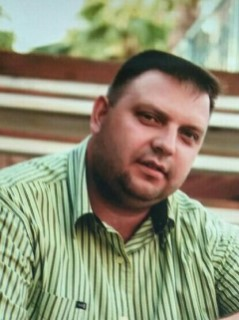
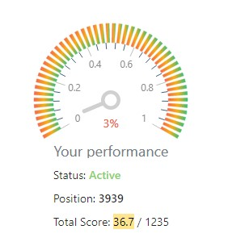

  
           
# **_Kirill Prokopyshko_** 

## _Student RS School stage0_  

## **Contact information:**
+ **_Phone:_** +375 29 7170780  
+ **_E-Mail:_** 7170780@gmail.com  
+ **_Telegram:_** https://t.me/KirillProkopyshko  
+ **_Discord:_** Kirill(@Parabellum81) 


## **About Myself:** 

I was born on May 19, 1981 in the city of Vitebsk. But my hometown of Orsha. Where I currently live. 

In 1998, I graduated from high school. From 2001 to 2006, I studied at the Belurussyan State Agricultural Academy. I successfully graduated from the Faculty of Economics and Law. I'm qualified as a lawyer.

During my studies at the academy, I worked as a systems engineer. Independently laid a local network at the enterprise. Served Win2000 Server. Installed and configured the work of Kerio MailServer.

Further work was mainly related to sales.

I have now decided to study JavaScript and become a Front End Developer.

## **Skills and Proficiency:**
+ HTML _Basic_
+ CSS _Basic_
+ Git, Github _Basic_
+ Markdown _Basic_
+ VS Code _Basic_


## **Code example:**
```
<style>
  .cascade {
    font-size: 25px;
  }

  p {
    padding: 15px;
  }
</style>

<p class="cascade">Параграф с внутренними отступами в 15 пикселей и размером шрифта 25 пикселей</p>
```
## **Courses:**
+ JS / FRONT-END. STAGE 0 (in process)  


## **Languages:**
+ English - A1
+ Russian - Native
+ Belorussian - Native